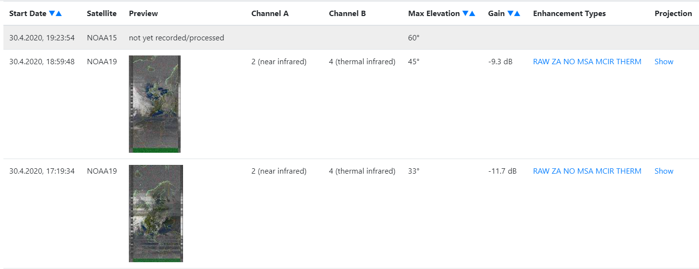
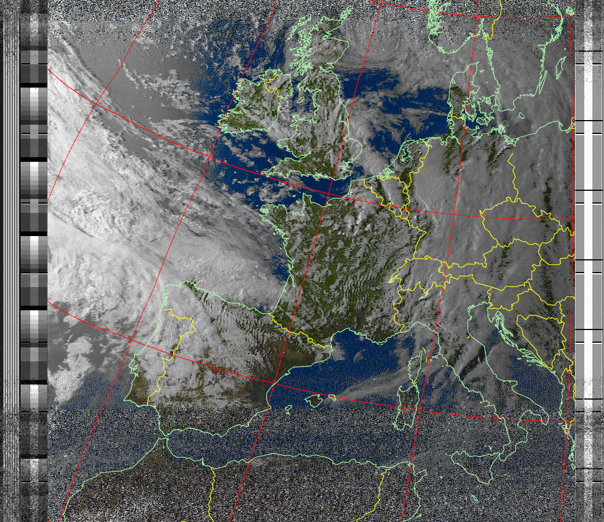

# noaa-web-viewer




## Installation
easiest installation is probably through docker-compose. There is an example `docker-compose.yml` in the root of this repository.

## What does my data have to look like?
right now, the noaa data has to be in a specific directory structure in a WebDAV share (for example: NextCloud):

- / (the configured WebDAV data directory)
    - upcoming_passes.txt
    - meta/
        - 2020/
            - 04/
                - 20200407-195220-NOAA18.txt
    - images/
        - 2020/
            - 04/
                - 20200407-195220-NOAA18-RAW.png
                - 20200407-195220-NOAA18-ZA.png
                - 20200407-195220-NOAA18-NO.png
                - 20200407-195220-NOAA18-MSA.png
                - 20200407-195220-NOAA18-MCIR.png
                - 20200407-195220-NOAA18-THERM.png

This is designed to work with https://github.com/patagonaa/wx-ground-station so look there for further reference on the file formats defined below:

`upcoming_passes.txt` looks something like this:
(start date, end date, max elevation, north-/southbound, satellite name, TLE1, TLE2)
```
1586625675,1586626574,29,northbound,NOAA 19,[...],[...]
1586669889,1586670841,85,southbound,NOAA 19,[...],[...]
```

meta files look something like this:
```
START_TIME=1587739795
END_TIME=1587740632
RECORD_END_TIME=1587740632
TLE1=[...]
TLE2=[...]
GAIN=Gain: 59.5
CHAN_A=Channel A: 2 (near infrared)
CHAN_B=Channel B: 4 (thermal infrared)
MAXELEV=22
```

## TODO:
- [ ] filtering
- [ ] actual database (instead of JSON file on disk)
- [ ] file watcher for new images (for scraper)
- [ ] ???